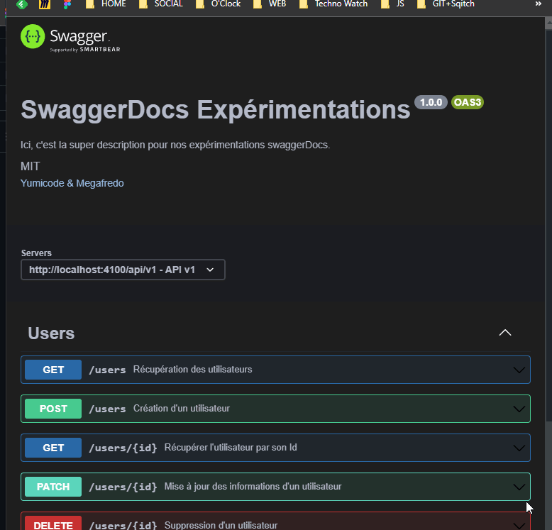

# Swagger Documentation

Auteurs : Yumicode & Megafredo

## Technologies

- Serveur NodeJS Express
- API en ES6 Module
- Documentation Swagger UI Express (JS Docs)
- Configuration des variables d'environnement avec dotenv

## Introduction

Cette petite API a été conçue dans le but de générer de la documention avec Swagger, celle-ci n'est pas utilisable et ne sert que de base pour nos tests (dans la limite de nos connaissances actuelles).

N'hésitez pas à nous faire un retour afin que l'on puisse procéder aux changements nécessaires ! ✨

---
## Sommaire

1. [Création de l'architecture](__docs__/01_Architecture.md)
2. [Initialisation de Swagger](__docs__/02_Initialisation.md)
3. [Mise en place des options](__docs__/04_options.md)
4. [Décomposition des options](__docs__/05_decomposition.md)
5. [Définition des status codes](__docs__/06_status_code.md)
6. [Autres Exemples de Js Docs](__docs__/06_Autres_exemples.md)

## Résultat final 🚀

### Sources diverses :

- [Swagger with NodeJs REST API](https://www.section.io/engineering-education/documenting-node-js-rest-api-using-swagger/#documenting-api-components)
- [Editor Swagger](https://editor.swagger.io/)
- [Specification Media-types](https://swagger.io/docs/specification/media-types/)
- [CSS Dark mode Swagger](https://github.com/Amoenus/SwaggerDark/)
- [OpenApi Specification](https://github.com/OAI/OpenAPI-Specification/blob/main/versions/3.1.0.md#tagObject)
- [Transform Tools](https://transform.tools/json-to-jsdoc)

