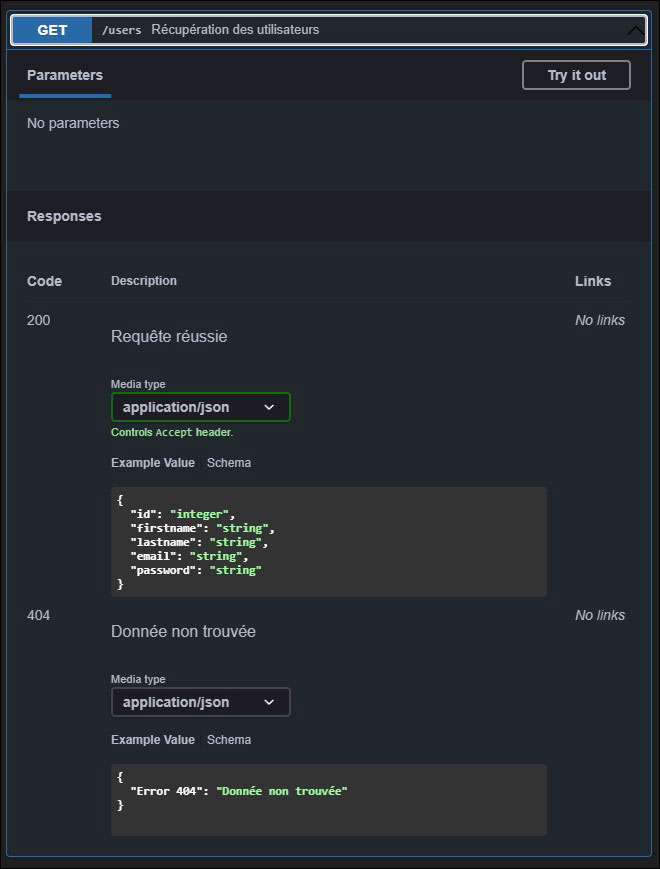
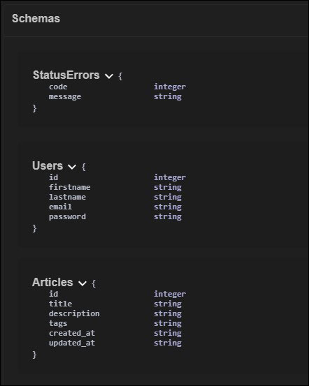

# Décomposition des options

Afin de rendre le fichier permettant la génération de notre documentation plus lisible, nous avons choisi de fragmenter tous les éléments.

## Paths

Pour la création de la documentation de chaque route, nous avons généré 2 fichiers séparant chaque élément pour les intégrer dans les options principales :

- Dans les options principales :

```js
paths: {
            //~ ------------- USERS
            '/users': users,
            '/users/{id}': userId,
            
            //~ ------------- ARTICLES
            '/articles': articles,
            '/articles/{id}': articleId
        
        },
```
Nous retrouvons biens les intitulés qui nous permettrons de détailler les actions qui pouvant être effectués concernant les éléments et les actions pouvant être effectués sur les articles.

Dans un fichier séparé, nous allons donc avoir chaque méthode avec leurs options.

Pour les utilisateurs (l'exemple se fera que sur une seule méthode qui sera la méthode GET pour avoir tous les utilisateurs) :

```js
//~ ------------------------------ EXAMPLES
//En CommonJS
//const {usersProperties, userExample} = require('./swagger-utils/swaggerExamples.js');

//const {error400, error404} = require('./swagger-utils/swaggerStatus.js');
//const {component} = require('./swagger-utils/swaggerComponents.js');

// En ES6 Module
import { usersProperties, userExample } from './swagger-utils/swaggerExamples.js';

import { error400, error404 } from './swagger-utils/swaggerStatus.js';
import { components } from './swagger-utils/swaggerComponents.js';

const users = {

    //~ --------------------------------------------- FETCH ALL USERS
    get: {
        tags: ['Users'],
        summary: 'Récupération des utilisateurs',
        responses: {
            200: {
                description: 'Requête réussie',
                content: {
                    'application/json': {
                        schema: {
                            type: 'object',
                            properties:usersProperties,
                            example: userExample  
                        }
                    }
                }
            },
            404: error404
        }
    },

[...,... all other methods]

}

// En CommonJS
//module.exports = {users};

// En ES6 Module
export {users};

```

Et le résultat : 




## Components

Dans les options, nous avons également la possibilité d'indiquer un schéma qui définit les types attendus de chaque résultat en sortie :



Voici comment le configurer : 

```js
// En CommonJS
// const { usersProperties, articlesProperties} = require('./swaggerExamples.js');

// En ES6 Module
import { usersProperties, articlesProperties } from './swaggerExamples.js';

const components = {
    schemas: {
        StatusErrors: {
            type: 'object',
            properties: {
                code: {
                    type: 'integer',
                },
                message: {
                    type: 'string'
                }
            }
        },
        //~ 
        Users: {
            type: 'object',
            properties: usersProperties
        },
        Articles: {
            type: 'object',
            properties: articlesProperties
        }
    }
};

// En CommonJS
// module.exports = { components };

//ES6 Modules
export { components };

```

## Status

Pour les options de status, nous avons choisi de mettre les configurations dans un fichier à part pour pouvoir les réutiliser pour chaque méthode en ayant besoin : 

```js
const error400 = {
    description: `Mauvaise requête. L'Id doit être un nombre entier et supérieur à 0`,
    content: {
        'application/json': {
            schema: {
                type: 'object',
                properties: { Error: { type: 'string' } },
                example: { 'Error 400': 'Mauvaise requête' }
            }
        }
    }
}

const error404 = {
    description: 'Donnée non trouvée',
    content: {
        'application/json': {
            schema: {
                type: 'object',
                properties: { Error: { type: 'string' } },
                example: { 'Error 404': 'Donnée non trouvée' }
            }
        }
    }
}

// En CommonJS
// module.exports = {error400, error404};

//ES6 Modules
export { error400, error404 };
```

## Dark Mode (pour le plaisir des devs !)

Et pour le plaisir des devs, nous avons fait une configuration personnalisée ! (la source du lien qui nous a permis de configurer le mode se trouve à l'accueil, le fichier étant important, il a été "raccourci")


```js
const swaggerDarkCss = `
a { color: #8c8cfa; }

::-webkit-scrollbar-track-piece { background-color: rgba(255, 255, 255, .2) !important; }

[........]
`;
//En CommonJS
//module.exports = {swaggerDarkCss};

// En ES6 Module
export { swaggerDarkCss };
```


[Chapitre précédent](03_options.md) / [Retour à l'accueil](../README.md) / [Chapitre suivant](05_status_code.md)

